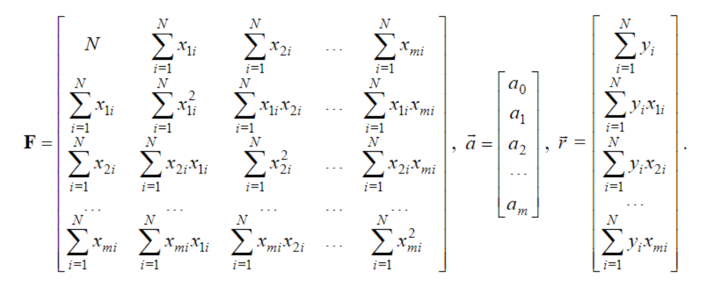
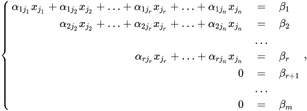
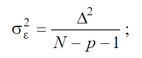
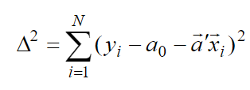

## Лабораторна робота №2

### ПОБУДУВАННЯ РЕГРЕСІЙНИХ ДІАГНОСТИЧНИХ МОДЕЛЕЙ

**Мета роботи** : вивчення принципів побудови регресійних діагностичних моделей на підставі таблиці експериментальних
даних.

#### Варіант 1

**Завдання** :

1. Використовувати ТЕД лабораторної роботи 1 в якості початкових даних
2. Розрахувати параметри регресії для кожного класу захворювань, використовуючи:
    * Лінійну множинну регресію
    * Метод Гауса
    * Фактори: `вік`, `досвід роботи` та `час роботи за місяць`
    * Відгук: `T-Lymphocytes`
3. Оцінити якість отриманих діагностичних моделей
    * Незміщена оцінка дисперсії помилки `σ^2`

### Хід роботи:

#### Моделі та початкові данні

Для виконання завдань було побудовано нову модель під назвою `Patient`, яка виконує роль представлення експерименту,
тобто містить фактори та відгук:

````
Patient {
    number; // номер пацієнта (або експерименту)
    factors; // фактори
    response; // відгук
    diagnosis; // діагноз
}
````

В даній роботі використовуються наступні фактори та відгук:

````
enum Factor {
    AGE, // вік 
    EXPERIENCE, // досвід роботи 
    MONTH_WORK_TIME // час роботи за місяць
}
````

````
Indication.T_LYMPHOCYTES // в ролі відгуку виступає значення для Т-лімфоцитів
````

Початкові данні зчитуються з файлу lab1_v2.txt, який зберігає данні, потрібні для класу `Patient`, розділенні
табуляцією. Для зчитування використовується метод `fromFile` класу `FilePatientReader`.

#### Лінійна множинна регресія

У загальному виді найкращим образом регресія проводиться в смислі мінімуму функціоналу. Задача мінімізації функціоналу
– знайти коефіцієнти рівняння регресії. Рівняння лінійної множинної регресії записується як рівняння прямої лінії в
багатовимірному просторі ознак.



Тобто спочатку знаходимо **матрицю X (або F)** наступним чином: як видно на формулі, елемент з індексом (0, 0) - це
кількість експериментів, далі нульовий стовпець і нульовий рядок містять значення сум факторів.

````
List<Double> factorsSums = new ArrayList<>(Factor.values().length);

for (Factor factor : Factor.values()) {
    double sum = factorsMap.get(factor).stream()
            .mapToDouble(Double::doubleValue)
            .sum();
            
    factorsSums.add(sum);
}
````

Далі йдуть суми перемножень значень факторів так, що виходить симетрична матриця. Це схоже на те, як ми знаходили
залежність між ознаками в першій роботі та застосовували один із коефіцієнтів, тільки тепер замість коефіцієнтів -
перемноження значень з однаковим індексом та знаходження суми. Повністю метод для знаходження матриці X виглядає
наступним чином:

````
public static List<List<Double>> calculateXMatrix(List<Patient> patients) {
    Map<Factor, List<Double>> factorsMap = getFactorsMap(patients); // достаємо фактори з пацієнтів, та групуємо їх
                                                                    // тобто дістаємо вектори факторів
    List<List<Double>> result = new ArrayList<>(factorsMap.size() + 1);

    List<Double> factorsSums = new ArrayList<>(Factor.values().length);

    for (Factor factor : Factor.values()) {
        double sum = factorsMap.get(factor).stream()
                .mapToDouble(Double::doubleValue)
                .sum();

        factorsSums.add(sum);                                       // перший рядок і стовпець будуь містити суми 
    }                                                               // значень факторів

    // використовуємо метод із першої роботи для побудови симетричної матриці, але поки що без першого стовпця
    List<List<Double>> columns = Matrices.buildSymmetricRelations(factorsMap, RegressionMatrices::sumOfMultiplies);

    // додаємо рядок зверху
    for (int i = 0; i < columns.size(); i++) {
        List<Double> column = columns.get(i);
        column.add(0, factorsSums.get(i));
    }
    
    // додаємо стовпець зліва
    List<Double> firstColumn = new ArrayList<>(factorsMap.size());
    firstColumn.add((double) patients.size());
    firstColumn.addAll(factorsSums);

    result.add(firstColumn);
    result.addAll(columns);

    return result;
}
````

Замість функції коефіцієнту ми передаємо посилання на метод `sumOfMultiplies`, який об'єднує два вектори шляхом
знаходження суми їх поелементних добутків.

````
private static Double sumOfMultiplies(List<Double> x1Values, List<Double> x2Values) {
    if (x1Values.size() != x2Values.size()) {
        throw new IllegalArgumentException("Sizes must be equal");
    }

    double result = 0;

    for (int i = 0; i < x1Values.size(); i++) {
        result += x1Values.get(i) * x2Values.get(i);
    }

    return result;
}
````

Далі знаходимо вектор `Y (або r)` наступним чином: перший елемент є сумою всіх відгуків:

````
double firstCell = responseList.stream()
        .map(Map.Entry::getValue)
        .mapToDouble(Double::doubleValue)
        .sum();
````

Кожний наступний елемент потрібно домножити на відповідний за індексом фактор:

````
for (int i = 0; i < factorValues.size(); i++) {
    cellValue += factorValues.get(i) * responseList.get(i).getValue();
}
````

Повністю алгоритм виглядає так:

````
public static List<Double> calculateYMatrix(List<Patient> patients) {
    List<Double> result = new ArrayList<>();

    Map<Factor, List<Double>> factorsMap = getFactorsMap(patients);              // отримуємо вектори факторів

    List<Map.Entry<Indication, Double>> responseList = patients.stream()         // отримуємо вектори відгуків
            .map(Patient::getResponse)
            .collect(Collectors.toList());

    double firstCell = responseList.stream()
            .map(Map.Entry::getValue)
            .mapToDouble(Double::doubleValue)
            .sum();                                                              // перший елемент є сумою всіх відгуків

    result.add(firstCell);

    factorsMap.forEach((factor, factorValues) -> {
        double cellValue = 0;

        for (int i = 0; i < factorValues.size(); i++) {                          // всі наступні елемнти домножуються на 
            cellValue += factorValues.get(i) * responseList.get(i).getValue();   // відповідні фактори та теж сумуються
        }

        result.add(cellValue);
    });

    return result;
}
````

#### Метод Гауса

Коли ми отримали матриці `X` та `Y`, ми можемо знайти коефіцієнти `a` за допомогою методу Гауса. Як відомо, метод Гауса
зазвичай поділяють на дві складові: спочатку йде "прямий хід" алгоритму, коли ми шляхом елементарних операцій
перетворення матриці приводимо її до виду верхньої трикутної матриці.



Далі йде "зворотний хід": з останнього ненульового рівняння виражають кожну з базисних змінних через небазисні й
підставляють до попередніх рівнянь. Повторюючи цю процедуру для всіх базисних змінних, отримують фундаментальний
розв'язок.

Отже, спочатку треба змінити логічне направлення зі стовпців на рядки:

````
List<Double> unifiedColumnValues = xMatrix.stream()
        .flatMap(Collection::stream)
        .collect(Collectors.toList());
               
List<Double> unifiedRowValues = changeLogicalDirection(unifiedColumnValues, xMatrix.size(), yMatrix.size());
List<List<Double>> rows = new ArrayList<>(ListUtils.partition(unifiedRowValues, xMatrix.size()));
````

Далі об'єднати матриці `Х` та `Y` для отримання розширеної матриці:

````

private static List<List<Double>> joinMatrices(List<List<Double>> xMatrix, List<Double> yMatrix) {

    if (xMatrix.size() != yMatrix.size()) {
        throw new IllegalArgumentException(SIZE_ERROR_MESSAGE);
    }

    List<List<Double>> result = new ArrayList<>(xMatrix.size());

    for (int i = 0; i < xMatrix.size(); i++) {
        List<Double> fullRow = new ArrayList<>(xMatrix.get(i));
        fullRow.add(yMatrix.get(i));

        result.add(fullRow);
    }

    return result;
}
````

Тепер можна починати "прямий хід" методу Гауса. Спочатку ми знаходимо рядок, поточний елемент якого не дорівнює нулю й
якщо це не верхній рядок, то переміщуємо його наверх:

````
int indexWithNonZeroElement = -1;

for (int rowIndex = columnIndex; indexWithNonZeroElement < 0; rowIndex++) {
    if (matrixRows.get(rowIndex).get(columnIndex) > 0) {
        indexWithNonZeroElement = rowIndex;
    }
}

if (columnIndex != indexWithNonZeroElement) {
    Collections.swap(matrixRows, columnIndex, indexWithNonZeroElement);
}
````

На кожному кроці беремо відповідний рядок, тобто на 1-му кроці беремо перший рядок, на другому другий і т.д.

````
List<Double> currentRow = matrixRows.get(columnIndex);
````

Далі ми обнуляємо всі значення з відповідним індексом `columnIndex` для рядків, що йдуть нижче `currentRow`:

````
for (int rowIndex = columnIndex + 1; rowIndex < matrixRows.size(); rowIndex++) {
    Double currentElement = currentRow.get(columnIndex); // значення на поточному рядку

    List<Double> rowBelow = matrixRows.get(rowIndex);    // один з рядків, що нижче поточного рядку
    Double elementBelow = rowBelow.get(columnIndex);     // значення з рядку

    double coefficient = elementBelow / currentElement;  // знаходимо співвідношення між елементом нижче та поточним

    List<Double> multipliedRow = currentRow.stream()     
        .map(curValue -> curValue * coefficient)         // домножуємо поточний рядок на коефіцієнт, знайдений вище
        .map(ROUND_TO_3_DECIMAL_PLACES::applyAsDouble)   // округляємо до 3 знаків після коми 
        .collect(Collectors.toList());

    List<Double> changedRow = multipliedRow.get(columnIndex) > elementBelow
        ? combineRows(multipliedRow, rowBelow, Double::sum)       // якщо значення більше нижнього, то додаємо
        : combineRows(rowBelow, multipliedRow, (a, b) -> a - b);  // інакше віднімаємо

    matrixRows.set(rowIndex, changedRow);                  // заміняємо рядок тим, який обчислили
}
````

Повністю "прямий хід" методу Гауса виглядає наступним чином:

````
private static List<List<Double>> forwardGaussElimination(List<List<Double>> extendedMatrixRows) {
    List<List<Double>> matrixRows = new ArrayList<>(extendedMatrixRows);

    for (int columnIndex = 0; columnIndex < matrixRows.size(); columnIndex++) {

        int indexWithNonZeroElement = -1;

        for (int rowIndex = columnIndex; indexWithNonZeroElement < 0; rowIndex++) {
            if (matrixRows.get(rowIndex).get(columnIndex) > 0) {
                indexWithNonZeroElement = rowIndex;
            }
        }

        if (columnIndex != indexWithNonZeroElement) {
            Collections.swap(matrixRows, columnIndex, indexWithNonZeroElement);
        }

        List<Double> currentRow = matrixRows.get(columnIndex);

        for (int rowIndex = columnIndex + 1; rowIndex < matrixRows.size(); rowIndex++) {
            Double currentElement = currentRow.get(columnIndex);

            List<Double> rowBelow = matrixRows.get(rowIndex);
            Double elementBelow = rowBelow.get(columnIndex);

            double coefficient = elementBelow / currentElement;

            List<Double> multipliedRow = currentRow.stream()
                .map(curValue -> curValue * coefficient)
                .map(ROUND_TO_3_DECIMAL_PLACES::applyAsDouble)
                .collect(Collectors.toList());

            List<Double> changedRow = multipliedRow.get(columnIndex) > elementBelow
                ? combineRows(multipliedRow, rowBelow, Double::sum)
                : combineRows(rowBelow, multipliedRow, (a, b) -> a - b);

            matrixRows.set(rowIndex, changedRow);
        }
    }

    return matrixRows;
}

private static List<Double> combineRows(List<Double> first, List<Double> second, DoubleBinaryOperator combiner) {

    if (first.size() != second.size()) {
        throw new IllegalArgumentException(SIZE_ERROR_MESSAGE);
    }

    List<Double> result = new ArrayList<>(first.size());

    for (int i = 0; i < first.size(); i++) {
        double sum = combiner.applyAsDouble(first.get(i), second.get(i));
        result.add(ROUND_TO_3_DECIMAL_PLACES.applyAsDouble(sum));
    }

    return result;
}
````

Далі з отриманої верхньої трикутної матриці ми видаляємо всі нульові елементи:

````
List<List<Double>> echelonFormWithoutZeros = echelonForm.stream()
    .map(list -> list.stream()
                  .filter(value -> value != 0)
                  .collect(Collectors.toList()))
    .collect(Collectors.toList());
````

І починаємо "зворотний хід" методу Гауса. Щоб почати з останнього рядка, що містить тільки одну невідому змінну,
"перевертаємо" нашу матрицю:

````
Collections.reverse(echelonForm);
````

Далі для кожного рядка також робимо реверсивну перестановку:

````
LinkedList<Double> row = new LinkedList<>(matrixRow);
Collections.reverse(row);
````

Таким чином перший елемент - це відгук (`Y`):

````
double response = Objects.requireNonNull(row.poll());
````

Далі, залежно від того, скільки коефіцієнтів ми вже знайшли, підставляємо їх та знаходимо суму вже відомих значень:

````
for (Double coefficient : reversedCoefficients) {
    sumWithDeterminedCoefficients += Objects.requireNonNull(row.poll()) * coefficient;
}
````

Тепер ми можемо вирахувати наш коефіцієнт для поточного рядка:

````
double coefficient = (response - sumWithDeterminedCoefficients) / Objects.requireNonNull(row.poll());
````

Перед поверненням обов'язково треба переставити всі елементи в зворотному порядку, адже ми знаходили їх, починаючи з
останнього:

````
Collections.reverse(reversedCoefficients);
````

Повністю "зворотний хід" гаусу виглядає наступним чином:

````
private static List<Double> gaussBackSubstitution(List<List<Double>> echelonForm) {
   Collections.reverse(echelonForm);

    if (echelonForm.get(0).size() != 2) {
       throw new IllegalStateException("Last row must be with size 2");
    }

    List<Double> reversedCoefficients = new ArrayList<>();

    for (List<Double> matrixRow : echelonForm) {
        LinkedList<Double> row = new LinkedList<>(matrixRow);
        Collections.reverse(row);

        double response = Objects.requireNonNull(row.poll());
        double sumWithDeterminedCoefficients = 0;

        for (Double coefficient : reversedCoefficients) {
            sumWithDeterminedCoefficients += Objects.requireNonNull(row.poll()) * coefficient;
        }

        double coefficient = (response - sumWithDeterminedCoefficients) / Objects.requireNonNull(row.poll());
        reversedCoefficients.add(coefficient);
    }

    Collections.reverse(reversedCoefficients);

    return reversedCoefficients;
}
````

#### Якість отриманих діагностичних моделей

Для оцінки якості було використано незміщену оцінку дисперсії помилки `σ^2`



На рисунку `N` - це кількість пацієнтів (експериментів), `m` - кількість факторів, а `Δ^2` - це залишкова сума
квадратів, яка вираховується за наступною формулою:



Алгоритм для знаходження `Δ^2` виглядає наступним чином:

````
public static Double squaresResidualSum(List<List<Double>> xMatrix, List<Double> yMatrix, List<Double> coefficients) {
    double result = 0;

    for (int i = 0; i < yMatrix.size(); i++) {
        List<Double> row = xMatrix.get(i);
        Double yElement = yMatrix.get(i);
        Double a0 = coefficients.get(0);

        double xMulASum = 0;

        for (int j = 1; j < row.size(); j++) {
            xMulASum += row.get(j) * coefficients.get(j);
        }

        result += Math.pow(yElement - a0 - xMulASum, 2);
    }

    return result;
}
````

## Результати

Для перевірки результатів пацієнтів було розбито на групи з однаковими діагнозами, щоб вирахувати оцінки для кожної з
груп:

````
List<Patient> patients = FilePatientReader.fromFile("/lab1_v2.txt");

Map<Integer, List<Patient>> groupedByDiagnosis = patients.stream()
            .sorted(Comparator.comparing(Patient::getDiagnosis))
            .collect(Collectors.groupingBy(Patient::getDiagnosis));

Map<Integer, List<List<Double>>> diagnosisToXMatrix = new HashMap<>(groupedByDiagnosis.size());
Map<Integer, List<Double>> diagnosisToYMatrix = new HashMap<>(groupedByDiagnosis.size());
Map<Integer, List<Double>> diagnosisToCoefficients = new HashMap<>();
Map<Integer, Double> predictedVariableVariance = new HashMap<>();

groupedByDiagnosis.forEach((diagnosis, patientList) -> {
    List<List<Double>> xMatrix = RegressionMatrices.calculateXMatrix(patientList);
    diagnosisToXMatrix.put(diagnosis, xMatrix);

    List<Double> yMatrix = RegressionMatrices.calculateYMatrix(patientList);
    diagnosisToYMatrix.put(diagnosis, yMatrix);

    List<Double> coefficients = RegressionMatrices.gaussianElimination(xMatrix, yMatrix);
    diagnosisToCoefficients.put(diagnosis, coefficients);

    Double squaresResidualSum = RegressionMatrices.squaresResidualSum(xMatrix, yMatrix, coefficients);
    double squareSigma = squaresResidualSum / (patients.size() - Factor.values().length - 1);
    predictedVariableVariance.put(diagnosis, squareSigma);
});

ConsoleWriter.printMatricesWithCoefficients(diagnosisToXMatrix, diagnosisToYMatrix, diagnosisToCoefficients,
                predictedVariableVariance);
````

### Вивід на консоль

````
Diagnosis #1
X Matrix: 
|     33.0 |    958.0 |    131.0 |   2092.0 | 
|    958.0 |  30784.0 |   4075.0 |  64894.0 | 
|    131.0 |   4075.0 |    687.0 |   8108.0 | 
|   2092.0 |  64894.0 |   8108.0 | 215744.0 | 

Y Matrix: 
|    25.12 |
|   730.78 |
| 96.62800 |
|   1643.9 |

| a0: 0.7625138162961168 | a1: 0.0017443526146024603 | a2: -0.02078733041291775 | a3: 4.823587674623394E-4 | 

Sigma squared (σ^2): 23196.142123315538
------------------------------------------------------------------
Diagnosis #2
X Matrix: 
|     41.0 |   1244.0 |    143.0 |   3010.0 | 
|   1244.0 |  41092.0 |   4614.0 | 100652.0 | 
|    143.0 |   4614.0 |    765.0 |  12310.0 | 
|   3010.0 | 100652.0 |  12310.0 | 336652.0 | 

Y Matrix: 
|    61.29 |
| 1839.859 |
| 213.4899 |
| 4375.020 |

| a0: 1.655000159183065 | a1: -0.004211187477592989 | a2: 0.009318697894536019 | a3: -8.833432236872532E-4 | 

Sigma squared (σ^2): 218728.56680286358
------------------------------------------------------------------
Diagnosis #3
X Matrix: 
|     33.0 |    837.0 |    126.0 |   2078.0 | 
|    837.0 |  22679.0 |   3267.0 |  57780.0 | 
|    126.0 |   3267.0 |    664.0 |   9859.0 | 
|   2078.0 |  57780.0 |   9859.0 | 204754.0 | 

Y Matrix: 
|    48.51 |
|  1233.74 |
| 181.8800 |
|  3079.64 |

| a0: 1.5182325792940905 | a1: -1.842975473339783E-4 | a2: -0.030136004690355798 | a3: 0.0011355719544746783 | 

Sigma squared (σ^2): 87166.05404150918
------------------------------------------------------------------
Diagnosis #4
X Matrix: 
|     30.0 |    894.0 |    139.0 |   2123.0 | 
|    894.0 |  28928.0 |   4446.0 |  71291.0 | 
|    139.0 |   4446.0 |    989.0 |  11911.0 | 
|   2123.0 |  71291.0 |  11911.0 | 220491.0 | 

Y Matrix: 
|   61.242 |
| 1842.848 |
|  291.958 |
| 4532.062 |

| a0: 1.9042237685983718 | a1: -0.003955181777580956 | a2: 0.009217941180160175 | a3: 0.0030004359996061935 | 

Sigma squared (σ^2): 145048.6698353116
------------------------------------------------------------------
````