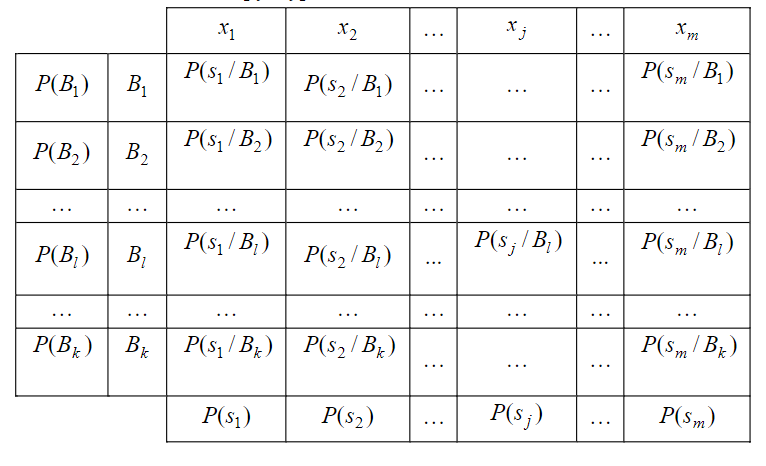
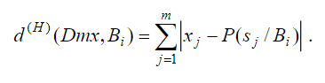
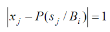

## Лабораторна робота №3

### СИНТЕЗ ДІАГНОСТИЧНИХ ПРАВИЛ НА ОСНОВІ ДЕТЕРМІНІСТСЬКОЇ ЛОГІКИ

**Мета роботи** : вивчення методу синтезу діагностичних правил, заснованого на детерміністській логіці та на відстані
Гемінґа (Hamming distance).

#### Варіант 1

**Завдання** :

1. Використовувати ТЕД лабораторної роботи 1 в якості початкових даних
2. Провести дихотомію початкових ознак
3. Розрахувати необхідні ймовірності та заповнити медичну пам’ять системи:
    * обчислити масив значень N1
    * обчислити масив значень N2
    * обчислити масив значень N3
    * обчислити ймовірності захворювань
    * обчислити умовні ймовірності появи ознак за діагнозом
    * обчислити апріорні ймовірності наявності ознак
4. Зберегти медичну пам'ять системи в файл
5. Виконати діагностику для 4 пацієнтів:
    * обчислити масив відстаней Гемінґа
    * у разі постанови діагнозу, порівняти його з діагнозом, що йде в початкових даних
    * якщо після першого етапу не було встановлено діагноз, виконати другий етап

### Моделі та початкові данні

Для реалізації даної роботи було створено наступні моделі:

#### Individual

Модель `Individual` показує сутність пацієнта, але це може бути не тільки людина, але й тварина наприклад.
Модель містить номер `number`, дихотомічні ознаки `indicationsDichotomy`, кількісні ознаки `indicationsValues`,
діагноз `diagnosis` та норми ознак `indicationsNorms`.

````
public class Individual {

    int number;
    Map<Indication, Boolean> indicationsDichotomy = new EnumMap<>(Indication.class);
    Map<Indication, Double> indicationsValues = new EnumMap<>(Indication.class);
    Diagnosis diagnosis;
    Norms<Indication> indicationsNorms;
}
````

При додаванні кількісної ознаки, ми одразу перевіряємо її норму та додаємо її дихотомічний еквівалент:

````
public void addIndication(Indication indication, Double indicationValue) {
    boolean notInNormRange = !indicationsNorms.test(indication, indicationValue.floatValue());

    indicationsDichotomy.put(indication, notInNormRange);
    indicationsValues.put(indication, indicationValue);
}
````

#### Norms and IndicationNorms

Норми, що використовуються в моделі `Individual` це реалізації інтерфейсу `Norms`, який використовується, щоб
протестувати, чи входить кількісна ознака в межи норми чи ні:

````
public interface Norms<T> {
    boolean test(T type, float value);
}
````

В нашій роботі було створено реалізацію `IndicationNorms`, що зберігає в собі межі норм для цієї роботи:

| Indication         | Norm range  |
|--------------------|-------------|
| Leukocytes         | 0    -    5 |
| Lymphocytes        | 1.5  -  2.5 |
| T-Lymphocytes      | 1    -    2 | 
| T-Helpers          | 0.6  -  0.8 | 
| RE-T-Suppressors   | 0.3  -  0.5 | 
| Sens. Theophylline | 0.1  -  0.2 |
| Res. Theophylline  | 0.8  -  >.. |
| B-Lymphocytes      | 0.15 -  0.3 |

````
Map<Indication, Range> indicationRangeMap = Map.of(
    Indication.LEUKOCYTES_NUMBER, new Range(Integer.MIN_VALUE, 5),
    Indication.LYMPHOCYTES_NUMBER, new Range(1.5f, 2.5f),
    Indication.T_LYMPHOCYTES, new Range(1, 2),
    Indication.T_HELPERS, new Range(0.6f, 0.8f),
    Indication.REMANUFACTURED_T_SUPPRESSORS, new Range(0.3f, 0.5f),
    Indication.SENS_THEOPHYLLINE, new Range(0.1f, 0.2f),
    Indication.RES_THEOPHYLLINE, new Range(0.8f, Integer.MAX_VALUE),
    Indication.B_LYMPHOCYTES, new Range(0.15f, 0.3f)
);
````

#### Diagnosis

Модель для діагнозу містить лише одне поле - номер діагнозу:

````
Diagnosis {
    int number;
}
````

#### Stats

Ця модель створена для того, щоб зберігати статистичні данні, такі як кількість пацієнтів із кожним з діагнозів,
ймовірності появи ознак для діагнозу та загалом і т.д.

````
Stats {
    Map<Diagnosis, List<Individual>> individualsByDiagnosis;
    Map<Diagnosis, Map<Indication, List<Individual>>> individualsIndications;
    Map<Indication, List<Individual>> generalIndividualsIndications;
    Map<Diagnosis, Double> diagnosisProbabilities;
    Map<Indication, Double> generalIndicationsProbabilities;
}
````

### Обчислення медичної пам'яті системи



Зміст медичної пам'яті – це система чисел, що пов'язує ознаки із захворюваннями. Кожен ряд – це певне
захворювання `B`, а кожен стовпець відповідає тій чи іншій ознаці `x`. При перетині рядів і стовпців стоять `P(s/B)` –
умовні ймовірності наявності `j`-ї дихотомічної ознаки при `i`-м захворюванні. Найлівіший стовпець таблиці містить
апріорні ймовірності захворювань `P(B)`, а нижній рядок – апріорні ймовірності наявності дихотомічних ознак `P(s)`.

#### N1

Розбиття пацієнтів на групи за однаковим діагнозом:

````
Map<Diagnosis, List<Individual>> individualsByDiagnosis = individuals.stream()
                .collect(Collectors.groupingBy(Individual::getDiagnosis));
````

#### N2 - DiagnosesStatistics.individualsIndications

Розширення масиву N1, де для кожного діагнозу окремо розглядається кожна ознака та пацієнти, що мають цю ознаку.
У нас є 8 ознак, а отже кожен діагноз буде містити по 8 ознак із пацієнтами, що мають цю ознаку та цей діагноз.

````
public static Map<Diagnosis, Map<Indication, List<Individual>>> individualsIndications(Map<Diagnosis, List<Individual>> individualsByDiagnosis,
                                                                                           Map<Indication, List<Individual>> individualsWithIndications) {
    Map<Diagnosis, Map<Indication, List<Individual>>> result = new HashMap<>();
    individualsByDiagnosis.keySet().forEach(diagnosis -> result.put(diagnosis, new EnumMap<>(Indication.class)));

    individualsByDiagnosis.forEach((diagnosis, individualsWithDiagnosis) ->
            Arrays.stream(Indication.values()).forEach(indication -> {
                List<Individual> individualsWithIndication = individualsWithIndications.get(indication);
                Collection<Individual> intersection = CollectionUtils.intersection(individualsWithDiagnosis, individualsWithIndication);
                result.get(diagnosis).put(indication, new ArrayList<>(intersection));
            })
    );

    return result;
}
````

#### N3 - IndicationStatistics.individualsWithIndications

Від N2 відрізняється тим, що в нас не буде розбиття за діагнозом, а будуть братися всі пацієнти та перевірятися на
кожну ознаку.

````
public static Map<Indication, List<Individual>> individualsWithIndications(List<Individual> individuals) {
    Map<Indication, List<Individual>> result = new EnumMap<>(Indication.class);

    Arrays.stream(Indication.values())
            .forEach(indication -> {
                List<Individual> individualsWithPositiveDichotomy = individuals.stream()
                        .filter(individual -> individual.isPositiveDichotomy(indication))
                        .collect(Collectors.toList());

                result.put(indication, individualsWithPositiveDichotomy);
            });

    return result;
}
````

#### Апріорні ймовірності захворювань - DiagnosesStatistics.priorProbabilities `P(B)`

````
public static Map<Diagnosis, Double> priorProbabilities(Map<Diagnosis, List<Individual>> individualsByDiagnosis) {
    Map<Diagnosis, Double> result = new HashMap<>(individualsByDiagnosis.size());

    int size = individualsByDiagnosis.values().stream()
            .map(Collection::size)
            .mapToInt(Integer::intValue)
            .sum();

    individualsByDiagnosis.forEach((diagnosis, individuals) -> {
        double probability = (double) individuals.size() / size;
        result.put(diagnosis, probability);
    });

    return result;
}
````

#### Умовні ймовірності появи ознак у пацієнтів із діагнозом `B` - `P(s/B)`

Це серце нашої медичної пам'яті, завдяки чому ми зможемо знаходити вірогідності прояву того, чи іншого діагнозу:

````
public static Map<Diagnosis, Map<Indication, Double>> computeMedicalMemoryTable(Stats stats) {
    Map<Diagnosis, List<Individual>> individualsByDiagnosis = stats.getIndividualsByDiagnosis();

    // Probabilities for Indications in each Diagnosis or Medical Memory Table
    Map<Diagnosis, Map<Indication, Double>> medicalMemoryTable = new HashMap<>();
    individualsByDiagnosis.keySet().forEach(diagnosis -> medicalMemoryTable.put(diagnosis, new EnumMap<>(Indication.class)));

    for (Map.Entry<Diagnosis, List<Individual>> entry : individualsByDiagnosis.entrySet()) {

        Diagnosis diagnosis = entry.getKey();
        List<Individual> individualsWithDiagnosis = entry.getValue();

        Arrays.stream(Indication.values()).forEach(indication -> {
            List<Individual> individualsWithPositiveDichotomies = individualsWithDiagnosis.stream()
                    .filter(individual -> individual.isPositiveDichotomy(indication))
                    .collect(Collectors.toList());

            // Filling indication probabilities by diagnosis
            double probability = individualsWithPositiveDichotomies.isEmpty()
                    ? 0
                    : (double) individualsWithPositiveDichotomies.size() / individualsWithDiagnosis.size();

            medicalMemoryTable.get(diagnosis).put(indication, probability);
        });
    }

    return medicalMemoryTable;
}
````

#### Апріорні ймовірності наявності `j`-ї ознаки - `P(S)`

Тобто вираховуємо те, як часто зустрічається ознака в кожного пацієнта, не зважаючи на діагнози:

````
public static Map<Indication, Double> generalProbabilities(List<Individual> individuals) {
    return Arrays.stream(Indication.values())
            .collect(Collectors.toMap(Function.identity(), indication -> {
                List<Individual> individualsWithPositiveDichotomy = individuals.stream()
                        .filter(individual -> individual.isPositiveDichotomy(indication))
                        .collect(Collectors.toList());

                return individualsWithPositiveDichotomy.isEmpty()
                        ? 0
                        : (double) individualsWithPositiveDichotomy.size() / individuals.size();
            }));
}
````

## Діагностика - DiagnosisQualifier

Для того, щоб провести діагностику для пацієнта нам потрібно пройти до трьох етапів:

1. обчислити відстань Гемінґа
2. спробувати точно визначити діагноз, знайшовши відповідні синдроми
3. якщо на попередньому етапі не було встановлено діагноз, то відкинути всі діагнози, що точно не підходять

### Відстань Гемінґа

Розраховується за наступною формулою для кожного діагнозу:



Але ми не будемо спішити знаходити суму, адже якщо ми не зможемо точно визначити діагноз за синдромом, нам знадобиться
кожне значення окремо на етапі 3.

````
public static Map<Diagnosis, List<Float>> computeHammingTable(Individual individual, Map<Diagnosis, Map<Indication, Double>> medicalMemory) {
    Map<Diagnosis, List<Float>> hammingTable = new HashMap<>(medicalMemory.size());

    medicalMemory.forEach((diagnosis, indicationProbabilities) -> {
        hammingTable.put(diagnosis, new ArrayList<>());

        for (Map.Entry<Indication, Double> entry : indicationProbabilities.entrySet()) {
            Indication indication = entry.getKey();
            Double probability = entry.getValue();

            int x = individual.isPositiveDichotomy(indication) ? 1 : 0;
            hammingTable.get(diagnosis).add((float) Math.abs(x - probability));
        }
    });

    return hammingTable;
}
````

### Визначення діагнозу за кодом синдрому

Якщо відстань Гемінґа для якогось з діагнозів дорівнює `0` це означає, що ми знайшли точний результат для цього
пацієнта. Тому тут беремо значення із формули вище, знаходимо їх суму для кожного діагнозу та порівнюємо з `0`:

````
public static Optional<Diagnosis> determineDiagnosis(Map<Diagnosis, List<Float>> hamingTable) {
    Map<Diagnosis, Double> gamingFinal = hamingTable.entrySet().stream()
            .collect(Collectors.toMap(Map.Entry::getKey, entry -> entry.getValue().stream()
                    .mapToDouble(Float::doubleValue)
                    .sum()));

    return gamingFinal.entrySet().stream()
            .filter(entry -> entry.getValue() == 0)
            .map(Map.Entry::getKey)
            .findFirst();
}
````

### Відкидання невідповідних діагнозів

Якщо ми не змогли визначити діагноз на попередньому кроці, тоді ми беремо значення з формули для знаходження відстані
Гемінґа та перевіряємо чи є значення, що дорівнюють `1`. 



Якщо для поточного діагнозу присутня хоча б одна така ознака, ми відкидаємо цей діагноз. Таким чином залишаються тільки
найбільш імовірні діагнози.

````
public static List<Diagnosis> findPossibleDiagnoses(Map<Diagnosis, List<Float>> hammingTable) {

    return hammingTable.entrySet().stream()
            .filter(entry -> !entry.getValue().contains(1f))
            .map(Map.Entry::getKey)
            .collect(Collectors.toList());
}
````

## Результати роботи

Основний цикл програми виглядає наступним чином:

````
    int[] indexes = {4, 50, 7, 3}; // specified by variant
    List<Individual> individuals = FileIndividualsReader.fromFile("/lab1_v2.txt");

    Stats stats = StatisticsUtils.collectStats(individuals); // N1, N2, N3 and other statistics with probabilities
    Map<Diagnosis, Map<Indication, Double>> medicalMemoryTable = StatisticsUtils.computeMedicalMemoryTable(stats);

    Map<Individual, List<Diagnosis>> determinationResults = new HashMap<>();

    for (int index : indexes) {
        Individual individual = individuals.get(index);

        Map<Diagnosis, List<Float>> hammingTable = DiagnosisQualifier.computeHammingTable(individual, medicalMemoryTable);

        List<Diagnosis> diagnoses = DiagnosisQualifier.determineDiagnosis(hammingTable)
                .map(Collections::singletonList)
                .orElseGet(() -> DiagnosisQualifier.findPossibleDiagnoses(hammingTable));

        determinationResults.put(individual, diagnoses);
    }

ConsoleWriter.printDiagnosesStatistics(stats);
ConsoleWriter.printIndicationStatistics(stats);
ConsoleWriter.printDeterminationResults(determinationResults);
````

````
DIAGNOSIS PROBABILITIES: 
Diagnosis #1 | Probability 0.2408 |
Diagnosis #2 | Probability 0.2992 |
Diagnosis #3 | Probability 0.2408 |
Diagnosis #4 | Probability 0.2189 |
------------------------------------------------------------------------------------------------------------------------------------------------------------------------------------------------------------------------------------------------------------------------------------------------------------------------------------------------------------------------------------------------------------
(N1) GROUPED INDIVIDUALS (PATIENTS) BY DIAGNOSIS: 
Diagnosis #1 | [1, 2, 5, 6, 7, 12, 16, 21, 33, 34, 52, 56, 59, 61, 65, 73, 74, 77, 82, 84, 87, 88, 90, 93, 95, 96, 105, 109, 111, 113, 115, 118, 120]
Diagnosis #2 | [3, 9, 13, 17, 19, 20, 28, 29, 30, 32, 37, 41, 42, 44, 45, 49, 51, 53, 55, 57, 58, 60, 62, 63, 64, 66, 72, 76, 79, 80, 81, 85, 89, 98, 99, 101, 106, 116, 122, 125, 133]
Diagnosis #3 | [8, 10, 14, 15, 22, 23, 27, 36, 38, 46, 48, 54, 67, 69, 70, 71, 83, 86, 91, 92, 100, 102, 103, 104, 107, 123, 124, 128, 130, 131, 132, 134, 136]
Diagnosis #4 | [4, 11, 18, 24, 25, 26, 31, 35, 39, 40, 43, 47, 50, 68, 75, 78, 94, 97, 108, 110, 112, 114, 117, 119, 121, 126, 127, 129, 135, 137]
------------------------------------------------------------------------------------------------------------------------------------------------------------------------------------------------------------------------------------------------------------------------------------------------------------------------------------------------------------------------------------------------------------
(N2) INDIVIDUALS (PATIENTS) INDICATIONS BY DIAGNOSES: 
Diagnosis #1
Indication Leukocytes        : [33, 34, 1, 59, 84, 109, 2, 93, 118, 52, 77, 61, 111, 12, 95, 120, 87, 21, 5, 96, 88, 113, 105, 6, 56, 73, 7, 65, 90, 115, 82, 16, 74]
Indication Lymphocytes       : [33, 95, 120, 87, 21, 5, 34, 1, 96, 59, 88, 84, 113, 109, 105, 6, 2, 93, 56, 118, 52, 77, 7, 65, 61, 90, 115, 82, 16, 111, 12, 74]
Indication T-Lymphocytes     : [33, 95, 120, 87, 21, 5, 34, 1, 96, 59, 88, 84, 113, 109, 105, 6, 2, 93, 56, 118, 77, 73, 7, 65, 61, 90, 115, 82, 16, 111, 12, 74]
Indication T-Helpers         : [33, 1, 84, 109, 2, 118, 52, 77, 61, 111, 12, 95, 120, 87, 21, 5, 96, 88, 113, 6, 56, 73, 7, 65, 90, 115, 82, 16, 74]
Indication RE-T-Suppressors  : [109, 2, 87, 5, 88, 105, 7, 82]
Indication Sens. Theophylline: [33, 34, 1, 59, 84, 109, 2, 93, 118, 52, 77, 61, 111, 12, 95, 120, 87, 21, 5, 96, 88, 113, 105, 6, 56, 73, 7, 65, 90, 115, 16, 74]
Indication Res. Theophylline : [33, 95, 93, 56, 120, 87, 118, 21, 52, 77, 73, 7, 5, 34, 1, 65, 96, 61, 59, 90, 88, 84, 115, 82, 113, 16, 111, 109, 12, 74, 105, 6, 2]
Indication B-Lymphocytes     : [1, 2, 93, 52, 111, 12, 87, 21, 105, 6, 73, 7, 74]

Diagnosis #2
Indication Leukocytes        : [66, 58, 116, 17, 42, 9, 133, 125, 51, 76, 101, 60, 85, 19, 44, 3, 28, 53, 20, 45, 37, 62, 29, 79, 13, 63, 30, 55, 80, 72, 64, 122, 89, 81, 106, 98, 32, 57, 49, 41, 99]
Indication Lymphocytes       : []
Indication T-Lymphocytes     : [66, 63]
Indication T-Helpers         : [66, 58, 116, 17, 42, 9, 133, 125, 51, 76, 101, 60, 85, 19, 44, 3, 28, 53, 20, 45, 37, 62, 29, 79, 13, 63, 30, 55, 80, 72, 64, 122, 89, 81, 106, 98, 32, 57, 49, 41, 99]
Indication RE-T-Suppressors  : [66, 58, 116, 17, 42, 9, 133, 125, 51, 76, 101, 60, 85, 19, 44, 3, 28, 53, 20, 45, 37, 62, 29, 79, 13, 63, 30, 55, 80, 72, 64, 122, 89, 81, 106, 98, 32, 57, 49, 41, 99]
Indication Sens. Theophylline: [66, 58, 116, 17, 42, 9, 133, 125, 51, 76, 101, 60, 85, 19, 44, 3, 28, 53, 20, 45, 37, 62, 29, 79, 13, 63, 30, 55, 80, 72, 64, 122, 89, 81, 106, 98, 32, 57, 49, 41, 99]
Indication Res. Theophylline : []
Indication B-Lymphocytes     : [66, 62, 29, 58, 116, 17, 79, 13, 42, 9, 133, 63, 30, 125, 55, 51, 80, 76, 72, 101, 64, 60, 122, 89, 85, 19, 81, 44, 106, 3, 98, 32, 28, 57, 53, 20, 49, 45, 41, 37, 99]

Diagnosis #3
Indication Leukocytes        : [100, 22, 123, 132]
Indication Lymphocytes       : [54, 83, 46, 104, 71, 38, 100, 67, 92, 22, 14, 10, 134, 27, 23, 48, 69, 36, 131, 86, 107, 8, 70, 132]
Indication T-Lymphocytes     : [54, 83, 104]
Indication T-Helpers         : [83, 67, 92, 102, 69, 36, 86, 136, 103, 54, 46, 104, 71, 38, 14, 23, 15, 131, 107, 8, 132]
Indication RE-T-Suppressors  : [124, 91, 83, 100, 67, 92, 10, 134, 27, 102, 69, 36, 86, 136, 103, 70, 128, 54, 46, 104, 71, 38, 22, 130, 23, 48, 15, 131, 123, 107, 132]
Indication Sens. Theophylline: [124, 91, 83, 100, 67, 92, 10, 134, 27, 102, 69, 86, 136, 103, 70, 128, 54, 46, 104, 71, 38, 22, 14, 130, 23, 48, 15, 123, 8, 132]
Indication Res. Theophylline : [91, 104, 92]
Indication B-Lymphocytes     : [124, 91, 54, 83, 46, 104, 71, 38, 100, 67, 92, 22, 14, 10, 27, 23, 48, 15, 102, 69, 36, 131, 123, 86, 107, 8, 136, 103, 70, 132]

Diagnosis #4
Indication Leukocytes        : [25, 50, 108, 75, 26, 117, 18, 43, 68, 35, 126, 110, 11, 135, 127, 94, 119, 78, 4, 112, 137, 129, 121, 47, 39, 97, 31, 114, 40, 24]
Indication Lymphocytes       : [4, 25, 50, 112, 108, 75, 137, 129, 26, 121, 18, 47, 43, 39, 68, 35, 97, 31, 126, 114, 110, 11, 40, 135, 127, 94, 24, 119, 78]
Indication T-Lymphocytes     : [4, 50, 112, 108, 26, 121, 18, 47, 39, 35, 97, 11, 40, 135, 127, 24, 119, 78]
Indication T-Helpers         : [25, 50, 108, 75, 26, 117, 18, 43, 68, 35, 126, 110, 11, 135, 127, 94, 119, 78, 4, 112, 137, 129, 121, 47, 39, 97, 31, 114, 40, 24]
Indication RE-T-Suppressors  : [25, 50, 108, 75, 26, 117, 18, 43, 68, 126, 110, 11, 135, 127, 94, 119, 78, 4, 112, 137, 129, 121, 47, 39, 97, 31, 114, 40, 24]
Indication Sens. Theophylline: [25, 50, 108, 75, 26, 117, 18, 43, 68, 35, 126, 110, 11, 135, 127, 94, 119, 78, 4, 112, 137, 129, 121, 47, 39, 97, 31, 114, 40, 24]
Indication Res. Theophylline : [110, 135]
Indication B-Lymphocytes     : [50, 117, 11, 119, 121, 97]

------------------------------------------------------------------------------------------------------------------------------------------------------------------------------------------------------------------------------------------------------------------------------------------------------------------------------------------------------------------------------------------------------------
(N3) GROUPED INDIVIDUALS (PERSONS) BY INDICATION: 
Indication Leukocytes        : [1, 2, 3, 4, 5, 6, 7, 9, 11, 12, 13, 16, 17, 18, 19, 20, 21, 22, 24, 25, 26, 28, 29, 30, 31, 32, 33, 34, 35, 37, 39, 40, 41, 42, 43, 44, 45, 47, 49, 50, 51, 52, 53, 55, 56, 57, 58, 59, 60, 61, 62, 63, 64, 65, 66, 68, 72, 73, 74, 75, 76, 77, 78, 79, 80, 81, 82, 84, 85, 87, 88, 89, 90, 93, 94, 95, 96, 97, 98, 99, 100, 101, 105, 106, 108, 109, 110, 111, 112, 113, 114, 115, 116, 117, 118, 119, 120, 121, 122, 123, 125, 126, 127, 129, 132, 133, 135, 137]
Indication Lymphocytes       : [1, 2, 4, 5, 6, 7, 8, 10, 11, 12, 14, 16, 18, 21, 22, 23, 24, 25, 26, 27, 31, 33, 34, 35, 36, 38, 39, 40, 43, 46, 47, 48, 50, 52, 54, 56, 59, 61, 65, 67, 68, 69, 70, 71, 74, 75, 77, 78, 82, 83, 84, 86, 87, 88, 90, 92, 93, 94, 95, 96, 97, 100, 104, 105, 107, 108, 109, 110, 111, 112, 113, 114, 115, 118, 119, 120, 121, 126, 127, 129, 131, 132, 134, 135, 137]
Indication T-Lymphocytes     : [1, 2, 4, 5, 6, 7, 11, 12, 16, 18, 21, 24, 26, 33, 34, 35, 39, 40, 47, 50, 54, 56, 59, 61, 63, 65, 66, 73, 74, 77, 78, 82, 83, 84, 87, 88, 90, 93, 95, 96, 97, 104, 105, 108, 109, 111, 112, 113, 115, 118, 119, 120, 121, 127, 135]
Indication T-Helpers         : [1, 2, 3, 4, 5, 6, 7, 8, 9, 11, 12, 13, 14, 15, 16, 17, 18, 19, 20, 21, 23, 24, 25, 26, 28, 29, 30, 31, 32, 33, 35, 36, 37, 38, 39, 40, 41, 42, 43, 44, 45, 46, 47, 49, 50, 51, 52, 53, 54, 55, 56, 57, 58, 60, 61, 62, 63, 64, 65, 66, 67, 68, 69, 71, 72, 73, 74, 75, 76, 77, 78, 79, 80, 81, 82, 83, 84, 85, 86, 87, 88, 89, 90, 92, 94, 95, 96, 97, 98, 99, 101, 102, 103, 104, 106, 107, 108, 109, 110, 111, 112, 113, 114, 115, 116, 117, 118, 119, 120, 121, 122, 125, 126, 127, 129, 131, 132, 133, 135, 136, 137]
Indication RE-T-Suppressors  : [2, 3, 4, 5, 7, 9, 10, 11, 13, 15, 17, 18, 19, 20, 22, 23, 24, 25, 26, 27, 28, 29, 30, 31, 32, 36, 37, 38, 39, 40, 41, 42, 43, 44, 45, 46, 47, 48, 49, 50, 51, 53, 54, 55, 57, 58, 60, 62, 63, 64, 66, 67, 68, 69, 70, 71, 72, 75, 76, 78, 79, 80, 81, 82, 83, 85, 86, 87, 88, 89, 91, 92, 94, 97, 98, 99, 100, 101, 102, 103, 104, 105, 106, 107, 108, 109, 110, 112, 114, 116, 117, 119, 121, 122, 123, 124, 125, 126, 127, 128, 129, 130, 131, 132, 133, 134, 135, 136, 137]
Indication Sens. Theophylline: [1, 2, 3, 4, 5, 6, 7, 8, 9, 10, 11, 12, 13, 14, 15, 16, 17, 18, 19, 20, 21, 22, 23, 24, 25, 26, 27, 28, 29, 30, 31, 32, 33, 34, 35, 37, 38, 39, 40, 41, 42, 43, 44, 45, 46, 47, 48, 49, 50, 51, 52, 53, 54, 55, 56, 57, 58, 59, 60, 61, 62, 63, 64, 65, 66, 67, 68, 69, 70, 71, 72, 73, 74, 75, 76, 77, 78, 79, 80, 81, 83, 84, 85, 86, 87, 88, 89, 90, 91, 92, 93, 94, 95, 96, 97, 98, 99, 100, 101, 102, 103, 104, 105, 106, 108, 109, 110, 111, 112, 113, 114, 115, 116, 117, 118, 119, 120, 121, 122, 123, 124, 125, 126, 127, 128, 129, 130, 132, 133, 134, 135, 136, 137]
Indication Res. Theophylline : [1, 2, 5, 6, 7, 12, 16, 21, 33, 34, 52, 56, 59, 61, 65, 73, 74, 77, 82, 84, 87, 88, 90, 91, 92, 93, 95, 96, 104, 105, 109, 110, 111, 113, 115, 118, 120, 135]
Indication B-Lymphocytes     : [1, 2, 3, 6, 7, 8, 9, 10, 11, 12, 13, 14, 15, 17, 19, 20, 21, 22, 23, 27, 28, 29, 30, 32, 36, 37, 38, 41, 42, 44, 45, 46, 48, 49, 50, 51, 52, 53, 54, 55, 57, 58, 60, 62, 63, 64, 66, 67, 69, 70, 71, 72, 73, 74, 76, 79, 80, 81, 83, 85, 86, 87, 89, 91, 92, 93, 97, 98, 99, 100, 101, 102, 103, 104, 105, 106, 107, 111, 116, 117, 119, 121, 122, 123, 124, 125, 131, 132, 133, 136]
------------------------------------------------------------------------------------------------------------------------------------------------------------------------------------------------------------------------------------------------------------------------------------------------------------------------------------------------------------------------------------------------------------
GENERAL INDICATIONS PROBABILITIES
Indication: Sens. Theophylline | Probability: 0.9708
Indication: Leukocytes         | Probability: 0.7883
Indication: RE-T-Suppressors   | Probability: 0.7956
Indication: T-Helpers          | Probability: 0.8832
Indication: B-Lymphocytes      | Probability: 0.6569
Indication: Lymphocytes        | Probability: 0.6204
Indication: Res. Theophylline  | Probability: 0.2773
Indication: T-Lymphocytes      | Probability: 0.4014
------------------------------------------------------------------------------------------------------------------------------------------------------------------------------------------------------------------------------------------------------------------------------------------------------------------------------------------------------------------------------------------------------------
COMPUTED RESULTS VS ACTUAL RESULTS: 
Patient #4   | COMPUTED: [3, 4]       | ACTUAL: 4 |
Patient #8   | COMPUTED: [3]          | ACTUAL: 3 |
Patient #5   | COMPUTED: [1, 3, 4]    | ACTUAL: 1 |
Patient #51  | COMPUTED: [2, 3, 4]    | ACTUAL: 2 |

````

Як можна побачити, ми знайшли як точні збіги, так і підібрали ймовірносні діагнози, які завжди містять правильний 
діагноз. Також було проведено обчислення для всіх 137 пацієнтів, де не було підібрано ні одного списку діагнозів, що 
не містив би правильну відповідь.